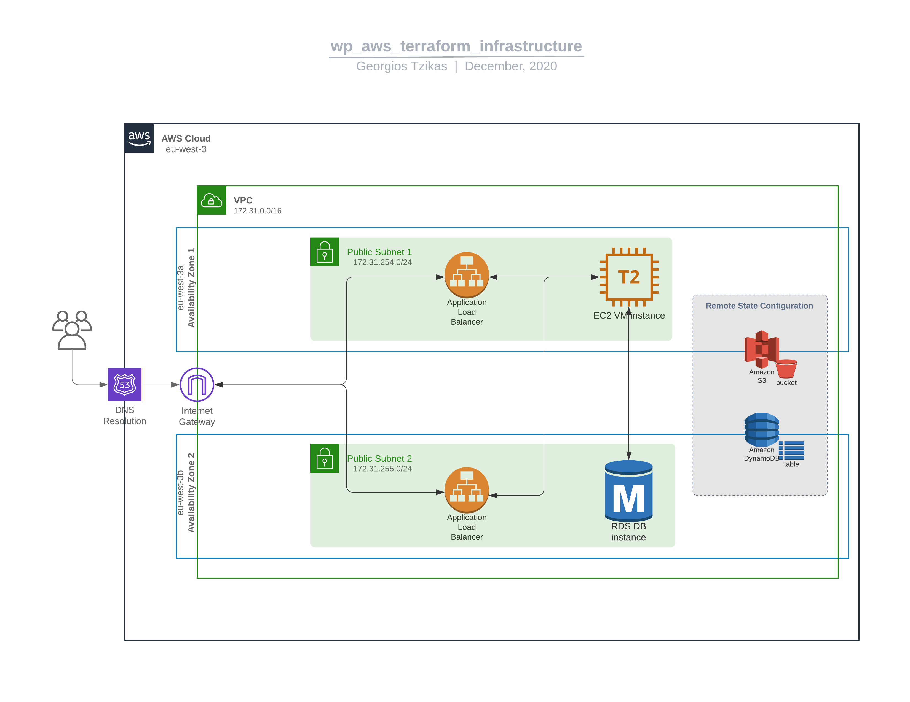

## Provision Infrastructure with Terraform in AWS



This repository is part of a bigger project. After you successfully apply this code you can run the Ansible playbook in the repository [wp_docker_ansible_aws](https://github.com/geortzik/wp_docker_ansible_aws) to provision a WordPress Docker container in the EC2 VM instance you just deployed with Terraform.

### Configuration

The following table lists the configurable parameters of `main.tf` and their default values. These can be found in `variables.tf`.

Parameter | Description | Default
--------- | ----------- | -------
`aws_region` | AWS region | `"eu-west-3"`
`aws_ig_id` | AWS internet gateway id | `"CHANGEME"`
`aws_av_zone_1` | AWS availability zone 1 | `"eu-west-3a"`
`aws_av_zone_2` | AWS availability zone 2 | `"eu-west-3b"`
`bucket_name` | Name of the S3 bucket. Needs to be unique | `"myuniquebucketname"`
`dynamodb_table_name` | Name of the dynamodb table. Needs to be unique | `"myuniquetablename"`
`subnet_cidr_block_1` | CIDR block for subnet1 | `"192.0.2.128/26"`
`subnet_cidr_block_2` | CIDR block for subnet2 | `"192.0.2.192/26"`
`my_ip` | CIDR block for SSH | `"192.0.2.0/32"`
`vm_ami_id` | AMI for the provisioned VM instance. Default is Ubuntu 20.04 LTS (Focal) image for the specific region (eu-west-3). Keep in mind to select one that fits your needs and your selected region. Free-tier eligible | `"CHANGEME"`
`vm_instance_type` | Instance type for the provisioned VM instance. Default is free-tier eligible | `"t2.micro"`
`domain_name` | Domain name | `"www.example.com"`
`zone_id` | Zone id | `"CHANGEME"`
`db_engine` | Engine for the RDS db instance | `"mysql"`
`db_instance_class` | Instance class for the RDS db instance. Default is free-tier eligible | `"db.t2.micro"`
`db_name` | RDS db instance name | `"db"`
`db_username` | Username for logging in the RDS db instance | `"rds_admin"`
`public_key` | Public key for the key pair | `"CHANGEME"`

In the s3 backend resource `aws_region`, `bucket` and `dynamodb_table` can't be set as variables.
If you operate in a different region, you have to change this argument as well.

> s3 bucket and dynamodb_table names need to be unique.


### Security groups

VM instance's security group allows traffic from the load balancer in port 80 and from your local machine via SSH in port 22
> Be sure to set your own local ip address

Load balancer's security group allows it to listen in port 443 [HTTPS] and in port 80 [HTTP].
You don't want any non TLS encrypted traffic, so there is a redirect action for the lb listener in port 80:

```
#Redirect action
resource "aws_lb_listener" "lb1_listener2" {
  load_balancer_arn = aws_lb.lb1.arn
  port              = "80"
  protocol          = "HTTP"

  default_action {
    type = "redirect"

    redirect {
      port        = "443"
      protocol    = "HTTPS"
      status_code = "HTTP_301"
    }
  }
}
```

> Keep in mind that, aws provisions every load balancer in two different subnets, by default.

### How to run

This terraform configuration stores the state file remotely in an s3 bucket and locks it with a dynamodb table.
You need to build the backend before enabling it.

Comment out the backend block like this:

```
#Require TF version to be same or greater than 0.12.13
terraform {
  required_version = ">=0.12.13"
#  backend "s3" {
#    bucket         = "myuniquetfk3yfoobucket"
#    key            = "terraform.tfstate"
#    region         = "eu-west-3"
#    dynamodb_table = "myuniquefootable"
#    encrypt        = "true"
#  }
}
```
Run `terraform init`. This will create a state file locally.
Then you should `terraform plan` (you should always plan first) and finally `terraform apply`.
This will build (besides the whole infra) an s3 bucket and a dynamoDB table.

Now that you have those resources, you need to uncomment the remote state backend like this:

```
#Require TF version to be same or greater than 0.12.13
terraform {
  required_version = ">=0.12.13"
  backend "s3" {
    bucket         = "myuniquetfk3yfoobucket"
    key            = "terraform.tfstate"
    region         = "eu-west-3"
    dynamodb_table = "myuniquefootable"
    encrypt        = "true"
  }
}
```

Now you are ready to push the local `.tfstate` file to the remote backend.
Rerun `terraform init`, for terraform to realize the added remote backend.

### GitHub Actions

In `./.github/workflows/terraform-plan.yml` exists a simple CI/CD pipeline that allows you to automatically test every change you make.
This workflow triggers when pushing to 'main'. It runs:
* `terraform fmt`
* `terraform plan`
* `terraform apply`

### License

All code is licensed under the [GNU General Public License version 3](https://www.gnu.org/licenses/gpl-3.0.html).
